# QLink- Game and Simulation Engine — Linux PCVR for Quest 3 (project preview)
 

## Videos

| Race Track Test & Soft-Body Damage | Bullet Penetration & Dynamic Surface | Early Build: Shoothouse Run |
| :---: | :---: | :---: |
|  |  |  |

**qlink** is an independent research project that brings wired PC VR to Linux for the Meta Quest 3. The PC renders the whole VR world, including the home, the avatar and its body IK, the applications and the final frames. It streams the result over the USB cable to the stock Quest Link receiver. Nothing is installed on the headset, and no custom Quest app is involved.

- **No Quest Link PC app.** qlink runs on Linux without Meta's Quest Link (Oculus) PC software. The Linux host talks to the stock Link receiver on the headset directly.
- **The simulation is the Link home.** The current simulation runs directly in the Link home: the headset shows the PC-rendered world in place of the usual Link home. At the same time, the same world can be played in 2D on the PC desktop.
- **Goal: replace the Link app completely.** A future OpenXR runtime is meant to let Steam and other VR games start through qlink, and return to the home afterwards (see the [roadmap](docs/ROADMAP.md)). This is planned, not available yet.

This repository is a **public preview**. It shows progress through renders, videos and short write-ups. The source code, internal research notes and protocol documentation are not published here.

> Status: experimental research, not a product. It has been tested on one Quest 3 with one PC (RTX 3080, Linux). Not affiliated with or endorsed by Meta.

> [!IMPORTANT]
> **Very early development version.** qlink is under active development. Work is focused on making the full path run reliably and on improving it step by step. Many parts are incomplete, and things change quickly.
>
> **Renders are updated regularly**, so this repository shows how the project progresses over time. See the [progress log](docs/PROGRESS.md).
>
> **Test versions and contributors:** there are no public builds yet. Later, test versions and collaboration will be offered **by invitation**. If you are interested, open a [tester interest](../../issues/new?template=tester-interest.yml) or [offer to help](../../issues/new?template=offer-help.yml) issue.
>
> **Ideas and feedback are welcome** through [issues](../../issues/new/choose) and [Discussions](../../discussions). See [CONTRIBUTING.md](CONTRIBUTING.md).

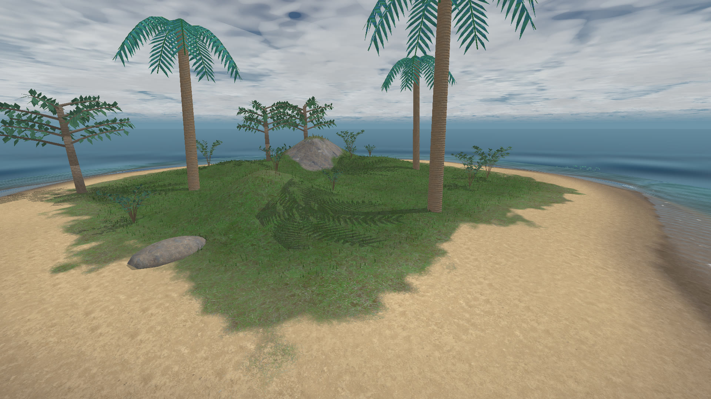

## Highlights

- **Native USB streaming to the stock Link receiver.** On one Quest 3, the Linux host completed the session handshake and started the stock Link runtime. It streamed a PC-rendered world as 4128 × 2208 side-by-side HEVC at 72 Hz while receiving head, controller and optical-hand tracking. One bounded run displayed frames for 120 s.
- **The PC does all the rendering.** A multithreaded CPU renderer is the default live path. A Vulkan renderer draws at full headset resolution and encodes HEVC in-process; it has been checked offline so far.
- **Own engine and worlds.** Built-in worlds include an island with shallow-water surf, an underwater reef, weather and grass and palms you can touch. There is also a race circuit with a drivable car and a shooting range with a four-room training course.
- **Full-body avatars.** Anatomical characters with 49 joints, all ten fingers animated, faces with expressions, clothing layers, and IK driven by head and hand tracking.
- **Player health simulation.** Projectile paths are traced through body regions and internal organs. Fractures, bleeding, breathing, consciousness, movement, weapon grip and death all follow from the hits.
- **Physical simulation.** Firearm mechanics, material damage (bullet holes, shoot-through walls, breaking timber, ricochets and fragments), vehicle dynamics and crash deformation, shallow-water surf, foliage contact and ragdolls.
- **Tooling.** A desktop console and world editor, a character studio, plus Animation Lab, Sound Lab, Crash Lab and a scripted clip maker.

## Gallery

All images below come from the project's **Vulkan GPU renderer** (RTX 3080). They are unedited offline renders, not concept art. The island ground uses photographic CC0 textures. The range and race props still use flat material colours because textures for them are not authored yet.

### Island world

| | |
| --- | --- |
| 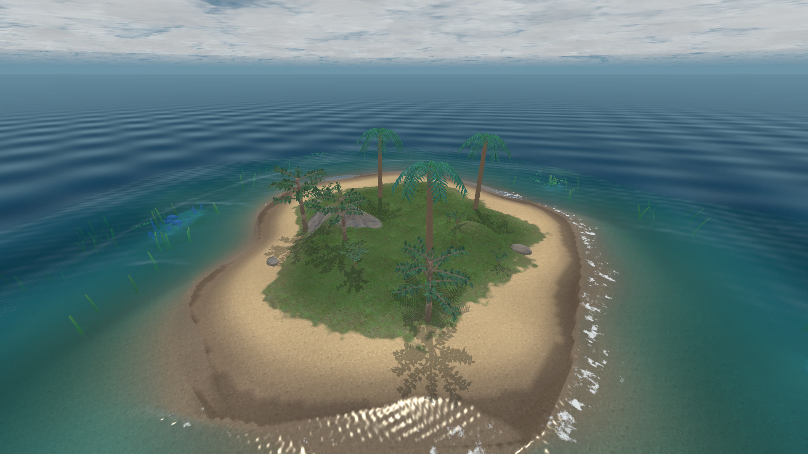 | 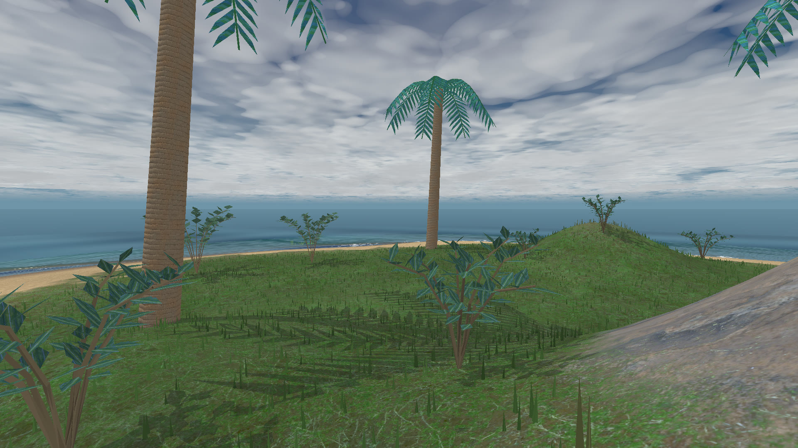 |
| Overview with simulated surf | Palms, plants and grass that react to touch |
| 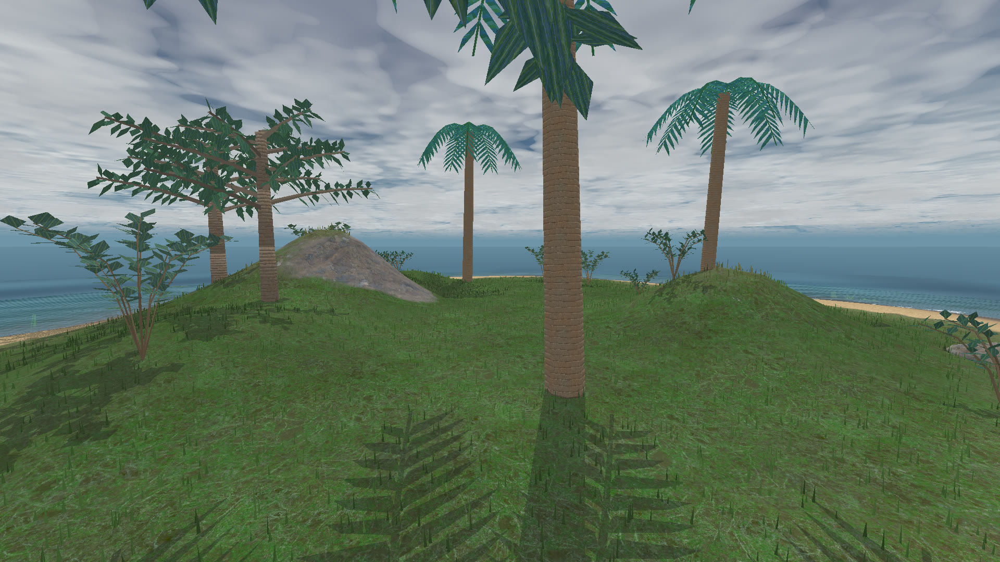 | 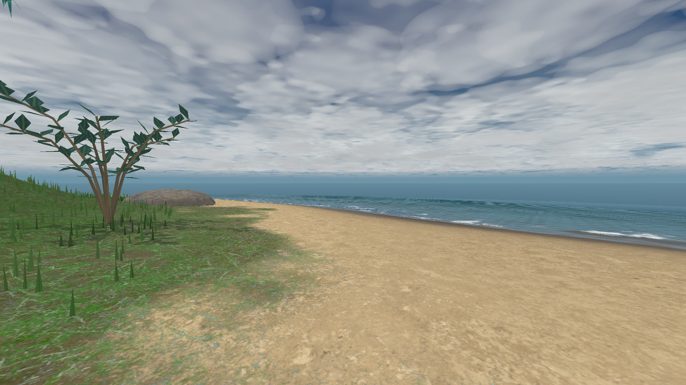 |
| Beach and wet sand | Refracting shallow water, foam and run-up |

**Ocean video:** [surf and water motion over 4 s](media/videos/island-ocean.mp4) · [beach view](media/videos/island-beach.mp4)

### Characters

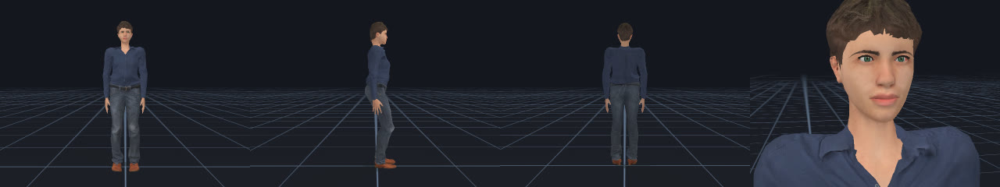

| | |
| --- | --- |
| 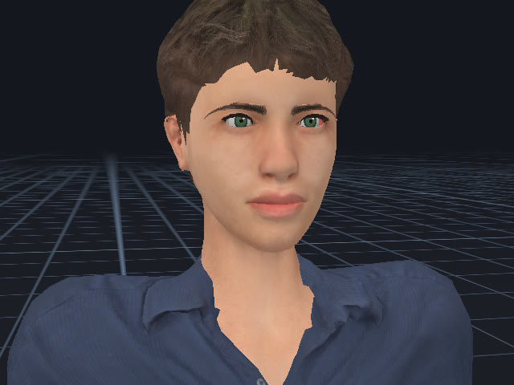 | 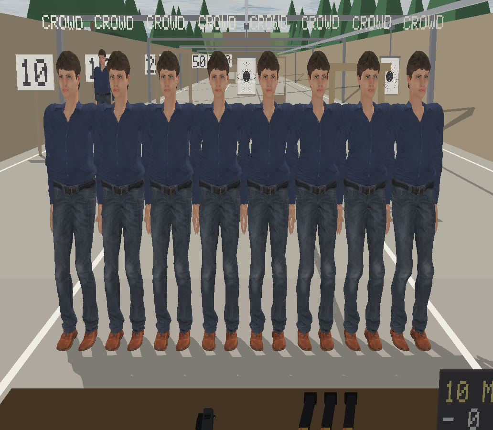 |
| Anatomical face with eyes, teeth and expression rig | Eight full-detail bodies skinned on the GPU in one frame |

### Animation

| Clip | Video |
| --- | --- |
| Pistol reload: magazine change and slide rack | [pistol-reload.mp4](media/videos/pistol-reload.mp4) |
| Pistol draw and aim, full body | [pistol-draw-aim.mp4](media/videos/pistol-draw-aim.mp4) |
| Walk cycle with foot locking | [walk-cycle.mp4](media/videos/walk-cycle.mp4) |

Clips are rig-independent `.qlanim` files. They are edited in Animation Lab and can be recorded from the wearer's PC-solved pose in VR.

### Shooting range and race circuit

| | |
| --- | --- |
| 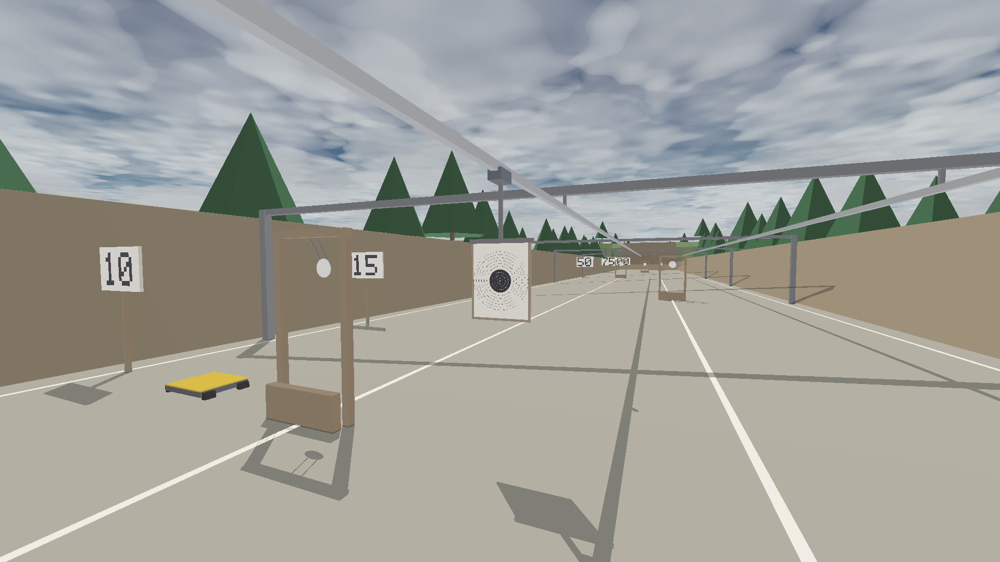 | 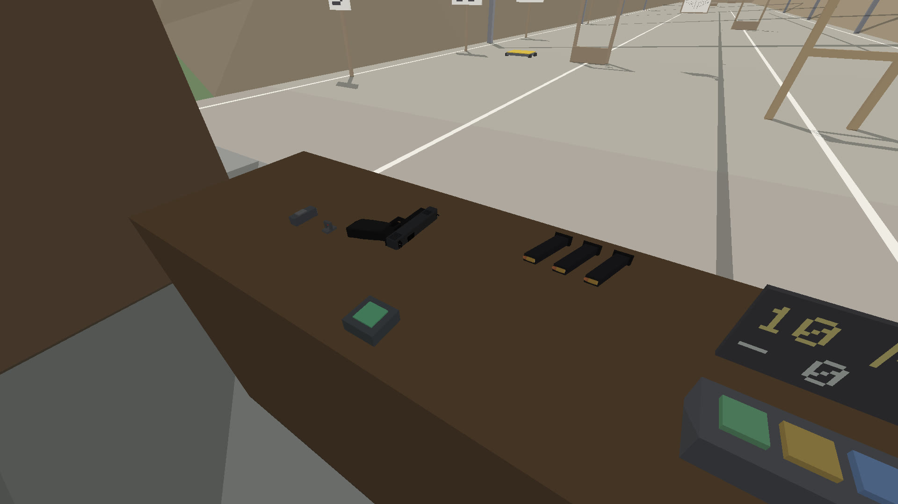 |
| Range lanes with distance boards and targets | Shooting counter with pistol and magazines |
| 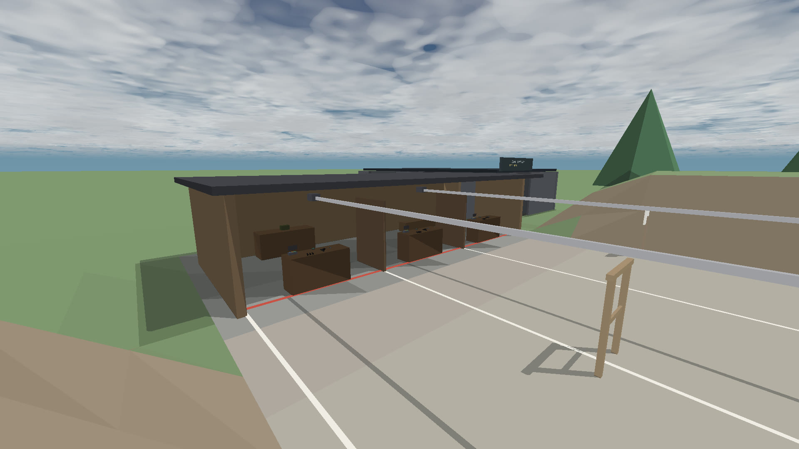 | 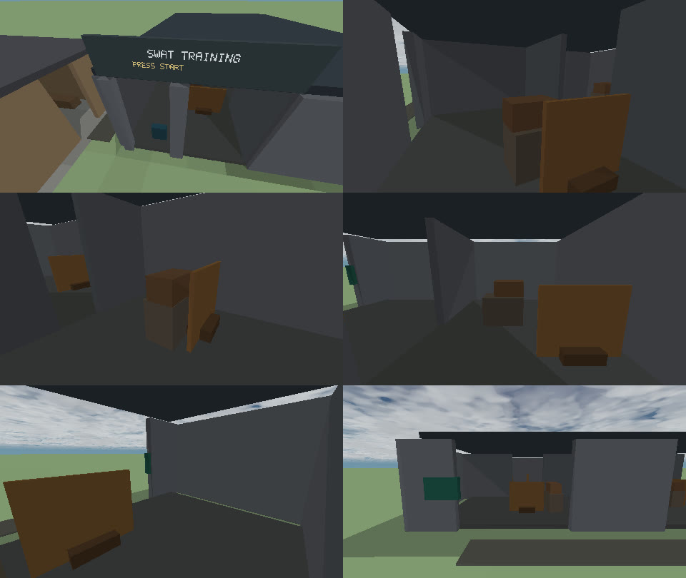 |
| Shoothouse | Four-room training course |
| 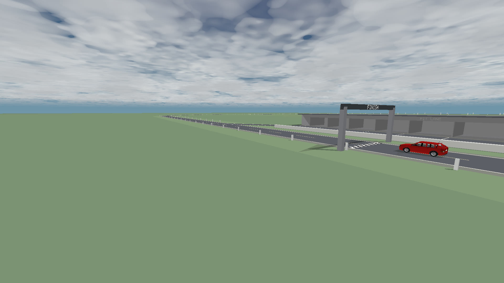 | 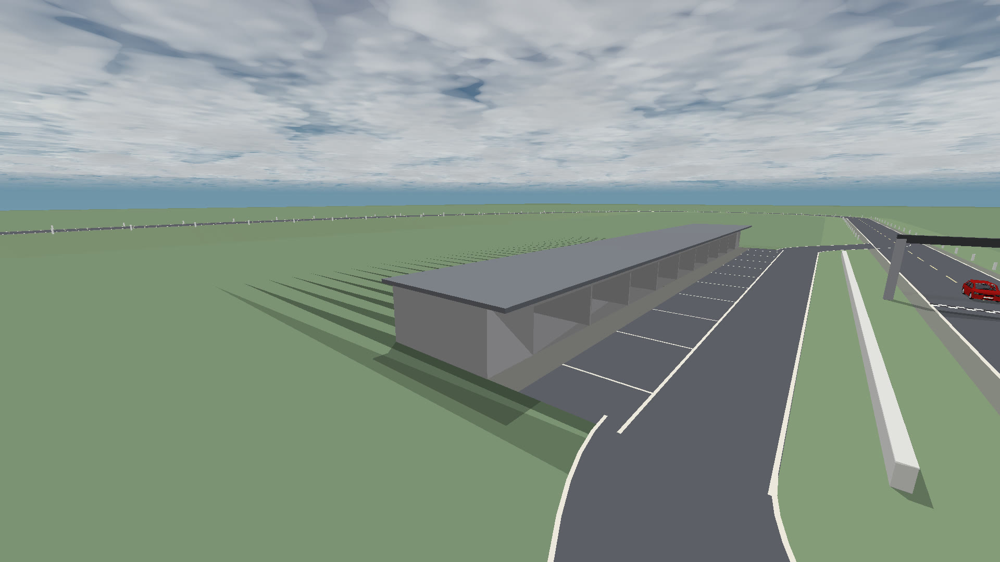 |
| Race circuit start line | Circuit hillcrest with the drivable car |

### Scripted scene

[**Scripted range clip (MP4, 5 s)**](media/videos/scripted-range-clip.mp4): a staged scene made with the clip maker and rendered on the GPU. A scripted shot event drives the health system, which produces the hit reaction and the fall.

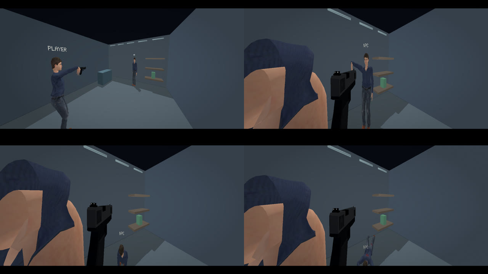

This is a scripted demonstration. It is not a headset capture and does not show autonomous NPC behaviour.

## Read more

- [Features](docs/FEATURES.md): what exists today, and how far each part is validated
- [Health and simulation](docs/SIMULATION.md): player health, damage, vehicles, water and physics
- [Architecture](docs/ARCHITECTURE.md): how the pieces fit together at a high level
- [Progress log](docs/PROGRESS.md): development timeline
- [Roadmap](docs/ROADMAP.md): where the project is heading

## Principles

- **Clean-room.** Behaviour is observed and documented independently. No proprietary runtime code, drivers, SDK headers or assets are copied or redistributed.
- **No circumvention.** No bypassing of authentication, entitlement, DRM or encryption, and no collection of credentials or account data.
- **Evidence first.** A capability is claimed only after a dated test under stated conditions. Offline and synthetic results are labelled as such.

---

*Preview updated 2026-10-04.*
