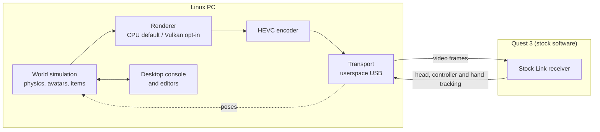

# Architecture

A high-level view. Protocol details and the source code are not part of this preview.

## Data flow

1. The headset sends head, controller and optical-hand tracking to the PC over USB.
2. The PC updates the world, solves full-body IK for the wearer and renders both eyes.
3. Frames are encoded as HEVC and sent back to the stock receiver, which displays them.
4. The desktop console and editors view and edit the same live world as a 2D window.

## Design choices

- **The PC owns everything.** The home, avatars, applications and final frames are computed on the PC, so the headset only displays and tracks.
- **Userspace and least privilege.** USB access runs in userspace and needs no kernel driver.
- **Rust throughout.** The host, engine, renderer and tools are written in Rust. Unsafe code is limited to FFI and USB boundaries.
- **Layered workspace.** Separate crates for math, transport, encoding, tracking, rendering, worlds, avatars, health, firearms, deformation, animation and tools. An automated check keeps layer dependencies one-directional.
- **Data, not code.** Worlds, props, weapons, clothing, sounds and animation clips are versioned JSON or clip files that people and agents can edit.
- **Deterministic and replayable.** Transport and session logic are tested against synthetic replays. Live hardware is an opt-in dependency of the tests.
- **Explicit clocks.** Monotonic timestamps with explicit clock domains, so pose prediction and frame pacing stay measurable.

## Rendering

- **CPU renderer (default live path):** multithreaded rasterizer with textured terrain, water, weather, skinned avatars and projected sun shadows. It renders at 2064 × 1104 per frame; offline medians are about 8–10 ms.
- **Vulkan renderer (opt-in):** renders at the full 4128 × 2208 and encodes HEVC in-process with Vulkan Video, without an external encoder process. Offline output matches the CPU reference.
- **Desktop views:** OpenGL in the editor, sharing a shader library with the headset renderer.
