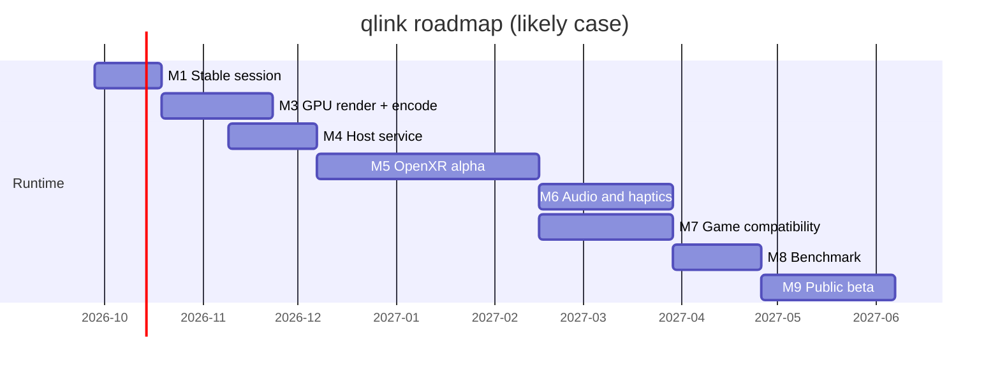

# Roadmap

These are planning estimates, not commitments. They assume one developer working part time.

| Milestone | Goal | Target (likely) | State |
| --- | --- | --- | --- |
| M0 | Native feasibility: handshake, tracking, video in headset | 2026-09-26 | Done on one Quest 3 |
| M1 | Stable session, reconnect and sleep recovery | 2026-10 | In progress |
| M2 | Complete controller and hand input | 2026-10 | Partial |
| M3 | Full-resolution GPU rendering and encoding in the headset | 2026-11 | Partial (offline) |
| M4 | Long-running host service | 2026-12 | Groundwork |
| M5 | OpenXR runtime alpha (standard VR apps) | 2027-02 | Planned |
| M6 | Headset audio and haptics | 2027-03 | Planned |
| M7 | Launching games, returning to home | 2027-04 | Planned |
| M8 | Performance benchmark on documented hardware | 2027-05 | Planned |
| M9 | Packaging and public beta | ~2027-06 | Planned |

In parallel, the world and editor track continues: worlds, avatars, tools and later shared spaces (see the vision below).

## Vision: a complete simulated world

The runtime milestones above make the headset path reliable. The long-term goal goes further: one connected, fully simulated world that people enter from VR or from a normal PC desktop, alone or together.

- **One world, two ways in.** The same simulation runs in VR on the headset and in 2D on the desktop. VR and desktop players share the same places, bodies, physics and health system.
- **Your own space as the entrance.** You start in a personal home with your own avatar. From there, portals lead to worlds, activities and, once the OpenXR runtime exists, to Steam and other VR games. You return to the same home afterwards.
- **Many places, not one map.** The world is made of many places: islands, cities, ranges, race circuits, interiors. Each is a versioned package with its own budgets, previews and licensing.
- **Multiplayer.** Shared rooms first, then many connected rooms and zones. A server owns the shared outcome of each room, so physics, hits and injuries stay consistent between players.
- **Simulation all the way down.** Bodies with organs and injuries, materials that break, vehicles that deform, water, weather and foliage. Everything players interact with nearby is simulated, not faked.
- **Creators.** Later, tools let people compose approved assets into their own places and share them deliberately.

### World stages

These stages follow the runtime milestones. Unlike the milestones, they have no dates yet.

| Stage | Outcome | State |
| --- | --- | --- |
| W0 | Simulated home in the Link home, desktop players in the same live world on one PC | Working (experimental) |
| W1 | Personal space: selectable homes, persistent avatar and settings, menus and safe return | Partial |
| W2 | Portal library: start a place or a VR game from the home and come back to it | Planned (needs M5 and M7) |
| W3 | Place packages: versioned, data-only worlds with previews, licensing, memory limits and rollback | Planned |
| W4 | Shared rooms: two or more players over the network see each other's presence, avatars and physics | Planned |
| W5 | Connected world: many rooms and zones, handoff between them, identity, friends and moderation | Vision |
| W6 | Creator ecosystem: build, share and export places with attribution and content review | Vision |

### Ground rules for the shared world

- **Privacy first.** Share only the minimum pose and action state a room needs. Raw headset diagnostics and device identifiers never leave the PC by default.
- **Safety before public rooms.** Muting, blocking, personal space, comfort options and return-to-home exist before any room opens to the public.
- **Measured scale.** Room sizes and player counts come from load tests, not from promises. Total population grows through many rooms, not one giant instance.
- **Offline still works.** The personal home and solo play never depend on an online service.
