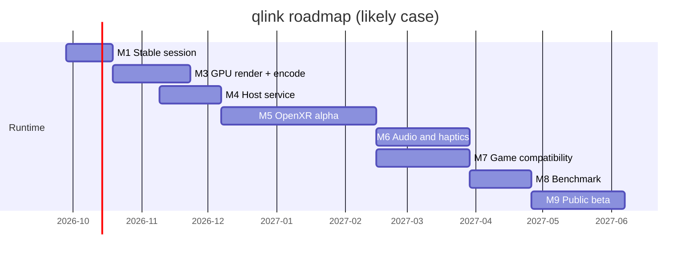

# Roadmap

These are planning estimates, not commitments. They assume one developer working part time.

| Milestone | Goal | Target (likely) | State |
| --- | --- | --- | --- |
| M0 | Native feasibility: handshake, tracking, video in headset | 2026-09-26 | Done on one Quest 3 |
| M1 | Stable session, reconnect and sleep recovery | 2026-10 | In progress |
| M2 | Complete controller and hand input | 2026-10 | Partial |
| M3 | Full-resolution GPU rendering and encoding in the headset | 2026-11 | Partial (offline) |
| M4 | Long-running host service | 2026-12 | Groundwork |
| M5 | OpenXR runtime alpha (standard VR apps) | 2027-02 | Planned |
| M6 | Headset audio and haptics | 2027-03 | Planned |
| M7 | Launching games, returning to home | 2027-04 | Planned |
| M8 | Performance benchmark on documented hardware | 2027-05 | Planned |
| M9 | Packaging and public beta | ~2027-06 | Planned |

In parallel, the world and editor track continues: worlds, avatars, tools and later shared spaces.

